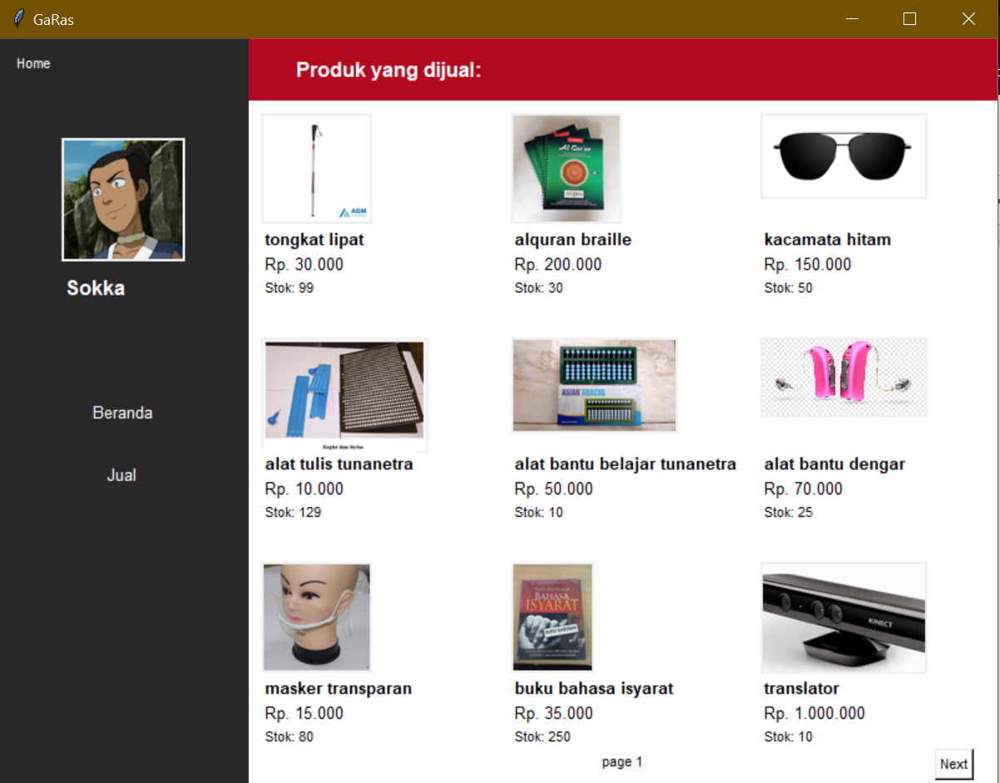
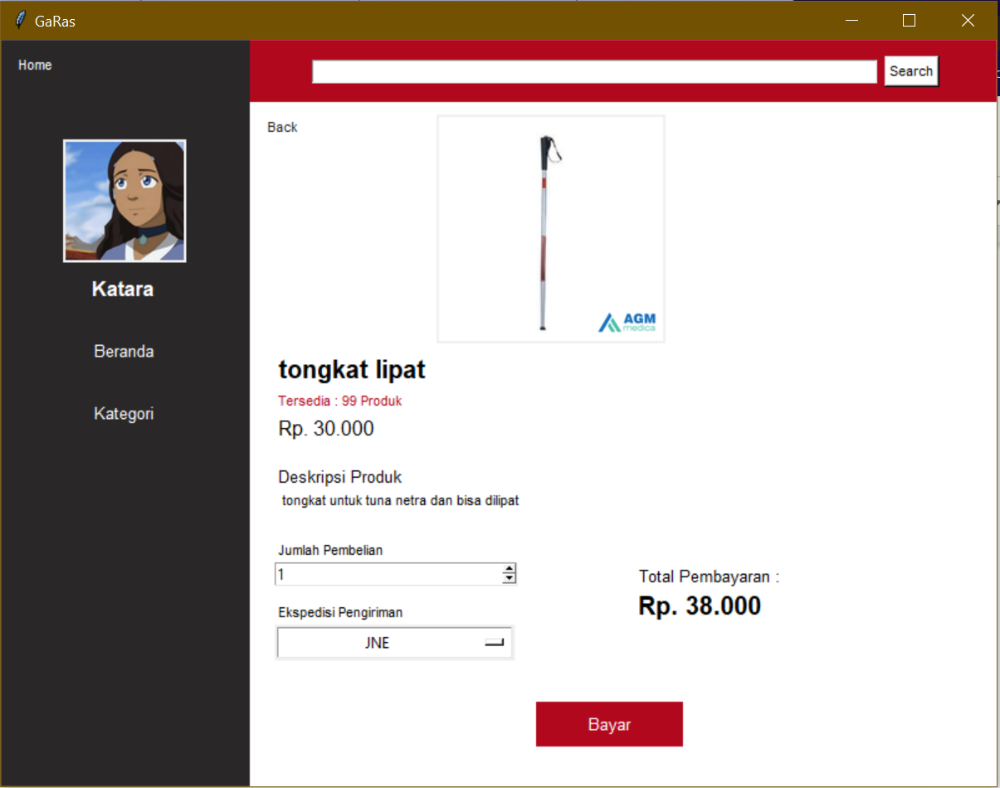
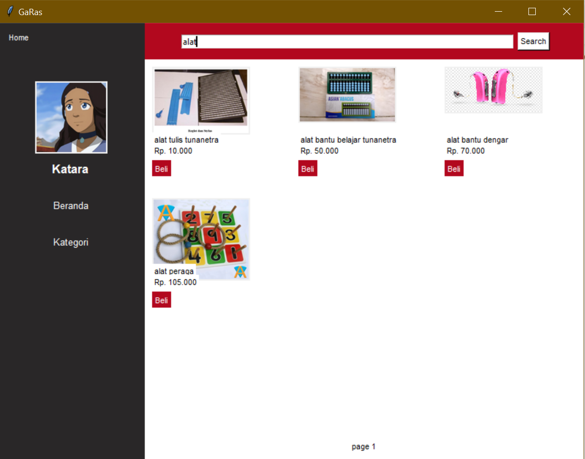
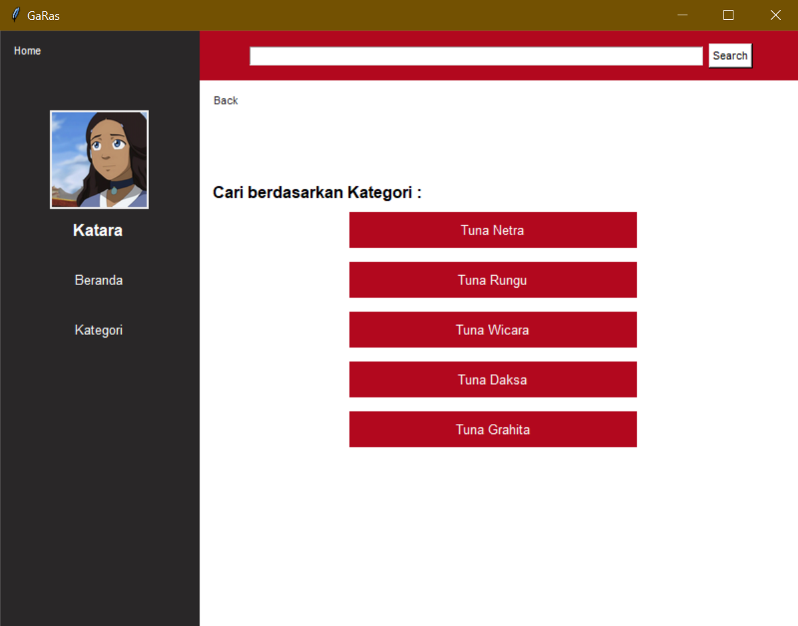

# IF2250-2020-K02-04-GaRas
Aplikasi Jual Beli sederhana bernama GaRas yang memanfaatkan konsep prosedural dalam implementasinya
Proyek ini merupakan tugas 7 mata kuliah IF2250-Rekayasa Perangkat Lunak

## Gameplay

* Aplikasi GaRas terdiri dari 2 peran yaitu sebagai penjual atau pembeli
* Penjual memiliki fitur untuk menjual suatu produk
* Pembeli memiliki fitur untuk membeli suatu produk, melakukan pencarian dengan keyword, dan melakukan pencarian dengan kategori

## Prerequisites

Berikut adalah keperluan untuk menjalankan game ini
* python
* tkinter
* mysql

## Running

Untuk menjalankan aplikasi, jalankan perintah berikut
```
GUI/python GaRas.py
```

## Unit Testing

* pytest : GUI/python Testing.py
* pylint: GUI/ModulFungsi/pylint tes.py result Your code has been rated at 3.99/10 

## Project Structure
Berikut adalah struktur folder dari proyek ini
```
+---Foto
+---GUI
+---docs
```
## Daftar Modul

* Modul Menjual - 13518023 Arif Rahman Amrul Ghani
* Modul Membeli - 13518026 Faris Fadhilah
* Modul Pencarian Keyword - 13518074 Iqbal Naufal
* Modul Pencarian Kategori - 13518095 Syarifuddin Fakhri Al Husaini

## Capture Modul
* Modul Menjual


* Modul Membeli


* Modul Pencarian Keyword


* Modul Pencarian Kategori


## Basis Data

* Tabel Kurir (id,nama,harga,alamat,image)
* Tabel Menjual (username,id)
* Tabel Pembeli (nama,tanggal_lahir,jenis_kelamin,email,nomor_gawai,alamat,username,password,image)
* Tabel Penjual (nama,tanggal_lahir,jenis_kelamin,email,nomor_gawai,alamat,username,password,image)
* Tabel Produksuk (id,nama,harga,stok,berat,spek,image,kategori)
* Tabel Transaksi (id_transaksi,pembeli,penjual,produk,id_kurir,total_biaya,status)

## Built With

* [Python](https://www.python.org/) - Bahasa pemrograman
* [Tkinter](https://wiki.python.org/moin/TkInter) - User Interface
* [MySQL](https://www.mysql.com/) - Basis Data

## Authors
* **Arif Rahman Amrul Ghani** - *13518023*
* **Faris Fadhilah** - *13518026*
* **Iqbal Naufal** - *13518074*
* **Syarifuddin Fakhri Al Husaini** - *13518095*

## Acknowledgments

* Dosen IF2250 K2, Dr.tech. Wikan Danar Sunindyo ST,M.Sc.
* Asisten Pembimbing, Rakhmad Budiono

## Notes
Fitur-fitur dasar dan tambahan tidak terlepas dari bug, terutama fitur-fitur yang merupakan spesifikasi *bonus*, oleh karena itu kami minta maaf atas ketidaksempurnaan aplikasi.

